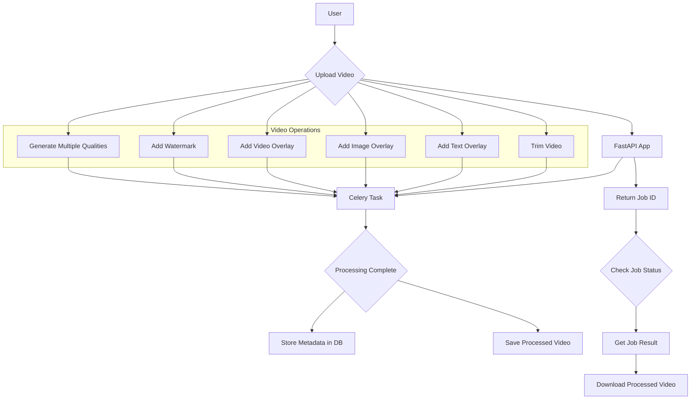

# Backend Engineer (Contract Role) Assignment – Video Processing APIs

This project is a FastAPI backend that handles video upload, processing (using ffmpeg), and database storage (Postgres).

## Features

- **Level 1 – Upload & Metadata:**
    - API to upload a video.
    - Store metadata in DB (filename, duration, size, upload_time).
    - API to list uploaded videos.
- **Level 2 – Trimming API:**
    - `POST /trim` → Accept video ID + start/end timestamps.
    - Return a trimmed video file.
    - Save trimmed video info in DB (link back to original).
- **Level 3 – Overlays & Watermarking:**
    - API to add **text, image and video overlays** with position & timing.
    - API to add a **watermark** (image/logo).  
    - Store overlay/watermark config in DB.
- **Level 4 – Async Job Queue:**
    - Asynchronous processing with Celery/Redis.
    - Return a `job_id` immediately.
    - `GET /status/{job_id}` → job status.
    - `GET /result/{job_id}` → download processed video.
- **Level 5 – Multiple Output Qualities:**
    - API to generate multiple versions of video (`1080p`, `720p`, `480p`).
    - Store all versions in DB.
    - API to fetch/download specific quality.

## Project Structure

```
.
├── backend
│   ├── celery_worker.py
│   ├── crud.py
│   ├── database.py
│   ├── Dockerfile
│   ├── __init__.py
│   ├── main.py
│   ├── models.py
│   └── schemas.py
├── docker-compose.yml
├── fonts
│   └── NotoSans-Regular.ttf
├── overlays
│   └── logo.png
├── outputs
├── qualities
├── requirements.txt
├── trims
└── README.md
```

## Setup with Docker

1.  **Prerequisites:**
    - Docker
    - Docker Compose

2.  **Environment Variables:**
    Create a `.env` file in the root of the project. You can use the following as a template. These credentials will be used to create the PostgreSQL database.
    ```
    POSTGRES_USER=user
    POSTGRES_PASSWORD=password
    POSTGRES_DB=videodb
    ```

3.  **Download Assets:**
    Download the assets from the provided Google Drive link and place them in the appropriate directories (in the root of the project):
    -   `fonts/` (e.g., `NotoSans-Regular.ttf`)
    -   `overlays/` (for images and videos)

4.  **Build and Run with Docker Compose:**
    ```bash
    docker-compose up --build
    ```

## API Usage and Testing

The API documentation is available at `http://localhost:8000/docs` after running the application.

Below are some `curl` commands to test the endpoints. Please replace the placeholders with actual values.

### 1. Upload a Video

```bash
curl -X POST -F "file=@/path/to/your/video.mp4" http://localhost:8000/upload/
```

This will return a `job_id`. You can use this `job_id` to check the status of the upload and get the result.

### 2. Check Job Status

```bash
curl http://localhost:8000/status/{job_id}
```

### 3. Get Job Result

Once the job is completed, you can get the result. For the upload endpoint, this will be the metadata of the video.

```bash
curl http://localhost:8000/result/{job_id}
```

### 4. List Videos

```bash
curl http://localhost:8000/videos/
```

This will return a list of all uploaded videos with their metadata. Note the `id` of the video you want to use for the next steps.

### 5. Trim a Video

```bash
curl -X POST -H "Content-Type: application/json" -d '{"video_id": 1, "start_time": 0, "end_time": 5}' http://localhost:8000/trim/
```

This will return a new `job_id`. You can use this `job_id` to get the trimmed video.

### 6. Add a Text Overlay

```bash
curl -X POST -H "Content-Type: application/json" -d '{"video_id": 1, "text": "Hello World", "x": 10, "y": 10, "start_time": 0, "end_time": 5}' http://localhost:8000/overlays/text
```

### 7. Add an Image Overlay

Make sure you have an image file (e.g., `logo.png`) in the `overlays` directory.

```bash
curl -X POST -H "Content-Type: application/json" -d '{"video_id": 1, "image_name": "logo.png", "x": 10, "y": 10, "start_time": 0, "end_time": 5}' http://localhost:8000/overlays/image
```

### 8. Add a Video Overlay

Make sure you have a video file (e.g., `overlay.mp4`) in the `overlays` directory.

```bash
curl -X POST -H "Content-Type: application/json" -d '{"video_id": 1, "video_name": "overlay.mp4", "x": 10, "y": 10, "start_time": 0, "end_time": 5}' http://localhost:8000/overlays/video
```

### 9. Add a Watermark

Make sure you have an image file (e.g., `watermark.png`) in the `overlays` directory.

```bash
curl -X POST -H "Content-Type: application/json" -d '{"video_id": 1, "image_name": "watermark.png"}' http://localhost:8000/watermark
```

### 10. Generate Different Qualities

```bash
curl -X POST -H "Content-Type: application/json" -d '{"video_id": 1, "quality": "480p"}' http://localhost:8000/quality
```

### 11. Get a Specific Quality

```bash
curl http://localhost:8000/videos/1/quality/480p -o output_480p.mp4
```

## Workflow Diagram

